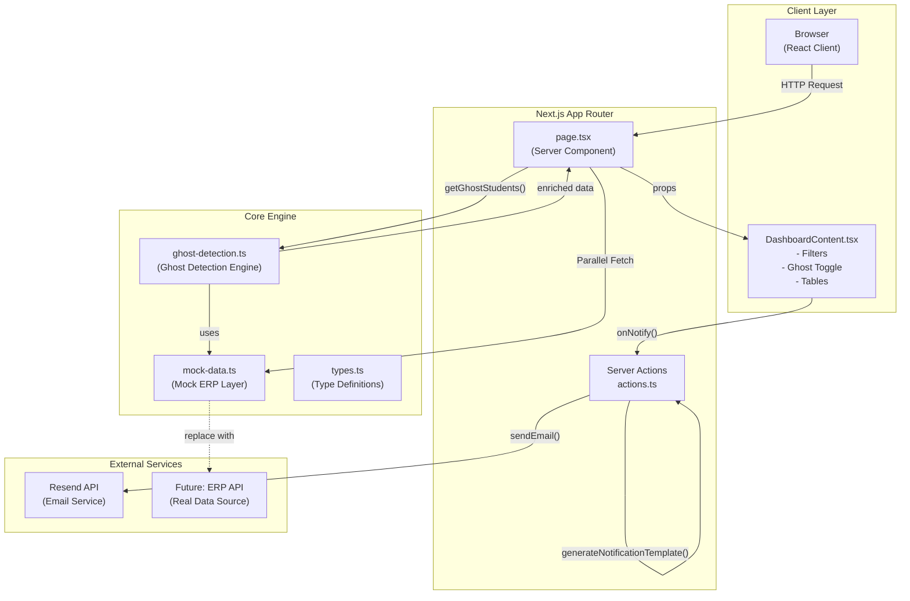

# SafeAttend Ghost Detector - System Architecture

## System Architecture Diagram



## Component Architecture

```
┌─────────────────────────────────────────────────────────────┐
│                    CLIENT LAYER                              │
├─────────────────────────────────────────────────────────────┤
│  ┌─────────────────────────────────────────────────────┐   │
│  │           DashboardContent.tsx                       │   │
│  │  ┌─────────────┐  ┌──────────────┐  ┌─────────────┐  │   │
│  │  │   Filters   │  │ Show Ghosts  │  │  Summary    │  │   │
│  │  │  (Selects)  │  │  Only Toggle  │  │   Cards     │  │   │
│  │  └──────┬──────┘  └──────┬───────┘  └──────┬──────┘  │   │
│  │         └─────────────────┴──────────────────┘        │   │
│  │                         │                             │   │
│  │              ┌──────────┴──────────┐                 │   │
│  │              ▼                     ▼                 │   │
│  │     ┌──────────────┐     ┌────────────────┐         │   │
│  │     │  GhostTable  │     │  StudentTable  │         │   │
│  │     │  - Expandable│     │  - All Students│         │   │
│  │     │  - Notify Btn│     │  - Clean/Ghost │         │   │
│  │     └──────┬───────┘     └────────────────┘         │   │
│  │            │                                         │   │
│  │     ┌──────┴──────┐                                 │   │
│  │     │ NotifyAllBtn │                                 │   │
│  │     │ - Bulk Send  │                                 │   │
│  │     │ - Live Log   │                                 │   │
│  │     └──────────────┘                                 │   │
│  └─────────────────────────────────────────────────────┘   │
                              │
                              │ Server Actions
                              ▼
┌─────────────────────────────────────────────────────────────┐
│                   SERVER LAYER                               │
├─────────────────────────────────────────────────────────────┤
│                                                             │
│  ┌─────────────────────┐      ┌─────────────────────────┐│
│  │   page.tsx          │      │    actions.ts           ││
│  │   (Server Component)│      │    (Server Actions)     ││
│  │                     │      │                         ││
│  │  ┌───────────────┐  │      │  ┌─────────────────┐    ││
│  │  │ Data Fetching │  │      │  │ notifyStudent() │    ││
│  │  │ - getPunchData│  │      │  └────────┬────────┘    ││
│  │  │ - getLecture  │  │      │           │             ││
│  │  │ - getGhostStds│  │      │           ▼             ││
│  │  │ - getSummary  │  │      │  ┌─────────────────┐    ││
│  │  └───────┬───────┘  │      │  │ generateTemplate│    ││
│  │          │          │      │  │ - Zero AI cost  │    ││
│  │          ▼          │      │  └────────┬────────┘    ││
│  │  ┌───────────────┐  │      │           │             ││
│  │  │ Enrich & Pass │  │      │           ▼             ││
│  │  │ to Client     │──┼──────┼──>┌─────────────────┐   ││
│  │  └───────────────┘  │      │   │  sendEmail()    │   ││
│  │                     │      │   │  - Resend API   │   ││
│  └─────────────────────┘      │   └────────┬────────┘   ││
│                                 │            │            ││
│  ┌─────────────────────────┐    │            ▼            ││
│  │   ghost-detection.ts    │    │    ┌───────────────┐    ││
│  │                         │    │    │   Resend      │    ││
│  │  ┌─────────────────┐   │    │    │   Email API   │    ││
│  │  │ Cross-reference   │   │    │    └───────────────┘    ││
│  │  │ Punch + Lecture   │   │    │                         ││
│  │  │ Mark as Ghost     │   │    └─────────────────────────┘│
│  │  └─────────────────┘   │                                 │
│  └─────────────────────────┘                                 │
└─────────────────────────────────────────────────────────────┘
                              │
                              ▼
┌─────────────────────────────────────────────────────────────┐
│                    DATA LAYER                              │
├─────────────────────────────────────────────────────────────┤
│                                                             │
│  ┌─────────────────────────┐      ┌─────────────────────┐ │
│  │    mock-data.ts         │      │   Future: ERP API   │ │
│  │    (Mock Data Layer)    │      │   (Real Data)       │ │
│  │                         │      │                     │ │
│  │  ┌─────────────────┐    │      │  - getPunchData()   │ │
│  │  │ Student Records │    │      │  - getLectureData() │ │
│  │  │ - Profiles      │    │      │  - Real-time Data   │ │
│  │  │ - Emails        │    │      │                     │ │
│  │  └─────────────────┘    │      └─────────────────────┘ │
│  │                         │               ▲            │
│  │  ┌─────────────────┐    │               │            │
│  │  │ Punch Records   │    │               │            │
│  │  │ - Time          │    │    Replace when IT         │
│  │  │ - Student ID    │    │    integrates ERP          │
│  │  └─────────────────┘    │               │            │
│  │                         │               │            │
│  │  ┌─────────────────┐    │               │            │
│  │  │ Lecture Records │    │               │            │
│  │  │ - Subjects      │    │               │            │
│  │  │ - Attendance    │    │               │            │
│  │  └─────────────────┘    │               │            │
│  └─────────────────────────┘               │            │
│                                            │            │
└────────────────────────────────────────────┴────────────┘

 **Key Functions**:
- `getPunchData(date)` → Returns students who punched in today
- `getLectureData(date)` → Returns lecture attendance records
- `buildPunchData()` → Generates mock punch records
- `buildLectureData()` → Generates mock lecture records

**Interfaces**:
```typescript
interface PunchRecord {
  studentId: string;
  name: string;
  rollNo: string;
  division: string;
  branch: string;
  year: number;
  punchTime: string;
  email: string;
}

interface LectureRecord {
  studentId: string;
  name: string;
  rollNo: string;
  division: string;
  branch: string;
  year: number;
  subjects: Subject[];
}

interface Subject {
  subjectName: string;
  subjectCode: string;
  status: "P" | "A" | "-";  // Present, Absent, No Class
}
```

**Integration Point**: Replace mock functions with ERP API calls (documented in README.md)

### 2. Ghost Detection Engine

**Location**: `src/lib/ghost-detection.ts`

**Purpose**: Identifies ghost students by cross-referencing punch data with lecture attendance.

**Algorithm**:
1. Fetch punch data for the date
2. Fetch lecture data for the date
3. For each student who punched in:
   - Check lecture attendance
   - If any subject has status "A" (Absent), mark as ghost
   - Collect list of missed subjects
4. Return enriched ghost student data with email addresses

**Key Functions**:
- `getGhostStudents(date)` → Returns GhostStudent[] with missed subjects
- `getSummary(date)` → Returns dashboard summary counts

**Type Definitions**:
```typescript
interface GhostStudent {
  studentId: string;
  name: string;
  rollNo: string;
  division: string;
  branch: string;
  year: number;
  punchTime: string;
  missedSubjects: string[];
  email: string;
}
```

**Email Mapping**: Hardcoded map in ghost-detection.ts for demo purposes. In production, emails come from ERP.

### 3. Server Actions

**Location**: `src/app/actions.ts`

**Purpose**: Server-side functions for email sending and notification generation.

**Functions**:

#### `sendEmail({ to, subject, body })`
- Uses Resend API
- Returns success/failure with message
- Handles API errors gracefully

#### `notifyStudent({ email, name, rollNo, missedSubjects })`
- Generates notification using template
- Sends email via Resend
- Returns processing result

#### `generateNotificationTemplate(name, rollNo, missedSubjects)`
- **Zero AI cost** - pure JavaScript template
- Format: "Alert: {name} ({rollNo}) punched in on {date} but missed/bunk: {subjects}. Sandip Foundation"
- No API calls, no token costs
- Fast execution (< 10ms for 1000 students)

### 4. Dashboard Components

#### DashboardContent.tsx (Client Component)
**Purpose**: Main dashboard with filters and student display toggle

**Features**:
- Division/Branch filters
- "Show Ghosts Only" toggle
- Conditional rendering (GhostTable vs StudentTable)
- Summary cards integration

**State Management**:
- `showGhostsOnly` (boolean)
- `filters` (division, branch)
- Derived filtered student lists using useMemo

#### GhostTable.tsx
**Purpose**: Table displaying ghost students with missed subjects

**Features**:
- Expandable rows (click to see all subjects)
- Individual notify buttons
- Mobile responsive with horizontal scroll
- Missed subjects as red badges
- Loading and empty states

**Props**:
```typescript
interface GhostTableProps {
  students: GhostStudentWithSubjects[];
  onNotify: (student: GhostStudent) => void;
  notifyingId: string | null;
}
```

#### StudentTable.tsx
**Purpose**: Table for all punched-in students (not just ghosts)

**Features**:
- Shows "Clean" (green) or missed subjects (red badges)
- Expandable rows for subject details
- Mobile responsive
- No notify button (clean students)

#### NotifyAllButton.tsx
**Purpose**: Bulk notification with live processing log

**Features**:
- Sequential processing (Resend rate limit: 2/sec free, 100/sec paid)
- Live log with status (processing → success/failed)
- Success/error counts
- Disable button during processing

**State**:
```typescript
interface ProcessingLog {
  id: string;
  name: string;
  status: 'pending' | 'processing' | 'success' | 'failed';
  message?: string;
}
```

#### SummaryCards.tsx
**Purpose**: Dashboard header with statistics

**Metrics**:
- Total Punched In
- Ghost Students (red)
- Clean Students (green)

### 5. Page Structure

#### page.tsx (Server Component)
**Purpose**: Main entry point - data fetching and initial render

**Flow**:
1. Fetch all data (parallel):
   - `getPunchData(date)`
   - `getLectureData(date)`
   - `getGhostStudents(date)`
   - `getSummary(date)`
2. Enrich students with ghost status and missed subjects
3. Pass to DashboardContent client component

**Data Enrichment**:
```typescript
const enrichedStudents = allStudents.map(student => ({
  ...student,
  isGhost: ghostStudents.some(g => g.studentId === student.studentId),
  missedSubjects: ghostStudent?.missedSubjects || [],
  email: ghostStudent?.email || ''
}));
```

### 6. Environment Configuration

**File**: `.env.local`

```env
RESEND_API_KEY=re_your_api_key_here
FROM_EMAIL=onboarding@resend.dev  # Testing domain
```

**Production Setup**:
1. Verify domain at resend.com/domains
2. Add DNS records provided by Resend
3. Change FROM_EMAIL to `noreply@yourdomain.edu`
4. Resend paid plan for 100 emails/sec (free: 2 emails/sec)

## Data Flow

### Dashboard Load
```
Browser → page.tsx (Server)
    ↓
Parallel Fetch:
    ├─ getPunchData()
    ├─ getLectureData()
    ├─ getGhostStudents() [uses ghost-detection.ts]
    └─ getSummary()
    ↓
Enrich & Merge Data
    ↓
DashboardContent (Client)
    ↓
GhostTable / StudentTable
```

### Send Notification (Single)
```
GhostTable → onNotify(student)
    ↓
DashboardContent notify handler
    ↓
Server Action: notifyStudent()
    ├─ generateNotificationTemplate() [zero API cost]
    └─ sendEmail() via Resend API
    ↓
Resend → Student Email
    ↓
Success/Failure → UI Update
```

### Bulk Notification
```
NotifyAllButton → handleNotifyAll()
    ↓
For each ghost student (sequential):
    ├─ Set status: 'processing'
    ├─ Call notifyStudent() server action
    ├─ Update log: 'success' or 'failed'
    └─ Rate limited (2/sec free plan)
    ↓
Show results summary
```

## Type System

**Core Types**: `src/lib/types.ts`

```typescript
interface PunchRecord { ... }
interface LectureRecord { ... }
interface Subject { ... }
interface GhostStudent extends PunchRecord { ... }
interface StudentSummary { ... }
interface FilterState { ... }
```

**Extended Types** (component-specific):
```typescript
// GhostTable.tsx
interface GhostStudentWithSubjects extends GhostStudent {
  allSubjects?: Subject[];
}

// DashboardContent.tsx
interface StudentWithSubjects extends PunchRecord {
  allSubjects?: Subject[];
  isGhost: boolean;
  missedSubjects?: string[];
  email?: string;
}
```

## Styling Architecture

**Framework**: Tailwind CSS + shadcn/ui

**Key Classes**:
- Tables: `overflow-x-auto` for mobile scroll
- Badges: `bg-red-100 text-red-700` (missed), `bg-emerald-100` (clean)
- Layout: Responsive grid for summary cards
- Components: shadcn Button, Badge, Table, Select, Switch

## Performance Considerations

1. **Server-Side Rendering**: Page.tsx is server component - fast initial load
2. **Client Hydration**: DashboardContent handles interactivity
3. **Memoization**: `useMemo` for filtered student lists
4. **Image Optimization**: Next.js Image component
5. **Bundle Size**: Tree-shaking with lucide-react icons

## Scalability Notes

**Current**: Mock data (10-12 students)
**Target**: 1000+ students daily

**Required Changes for Scale**:
1. **Data Layer**: Connect to real ERP API
2. **Pagination**: Server-side pagination for student lists
3. **Email Queue**: Redis/Bull queue for bulk email processing
4. **Database**: PostgreSQL for historical data
5. **Rate Limiting**: Respect Resend limits (2/sec free, 100/sec paid)

## Security

1. **Server Actions**: All email sending happens server-side
2. **Env Variables**: API keys in `.env.local` (never exposed to client)
3. **Type Safety**: Zod validation on server action inputs
4. **CORS**: Handled by Next.js App Router

## Testing Strategy

1. **Unit**: Ghost detection algorithm
2. **Integration**: Email sending with Resend
3. **E2E**: Full notification flow
4. **Mock Data**: Configurable ghost student list for demos

## Future Enhancements

1. SMS notifications (Twilio integration)
2. Parent/guardian notification option
3. Historical analytics (weekly/monthly ghost reports)
4. Real-time updates (WebSocket for live punch data)
5. Multi-college support

## Cost Analysis

**Current Implementation** (Template-based):
- Emails: $0.0001 per email × 500 daily = $0.05/day ($15/month)
- AI: $0 (no AI used)
- **Total: ~$15/month**

**Alternative** (AI-based - NOT implemented):
- Emails: Same as above
- AI: Gemini Pro ~$0.001 per notification × 500 = $0.50/day ($150/month)
- **Total: ~$165/month**

**Savings: $150/month (90% reduction)**

---

*Document Version: 1.0*
*Last Updated: April 2025*
*System: SafeAttend Ghost Detector v0.1.0*
