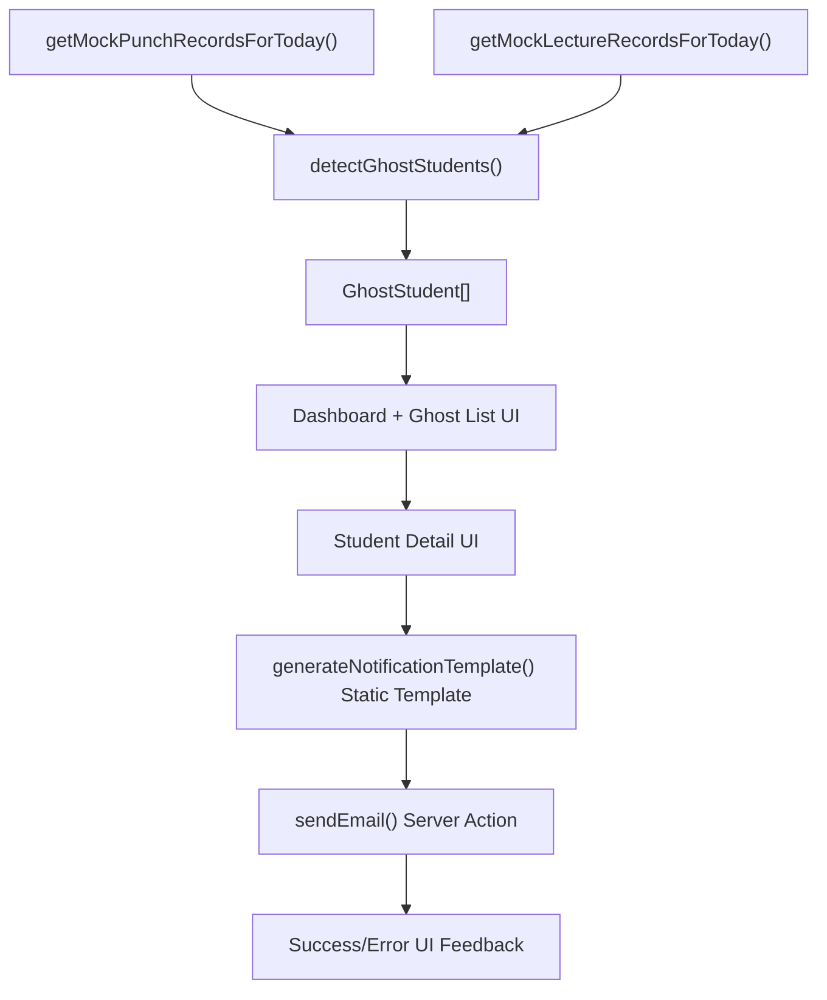

# SafeAttend Ghost Detector — Product Requirements Document (PRD)

## 1) Problem Statement

Students can complete gate face-punch attendance but still skip classroom lectures, creating a mismatch between entry attendance and lecture attendance. This makes it difficult for departments to identify "ghost students" in time. SafeAttend Ghost Detector solves this by cross-referencing punch records and lecture ERP status to flag students who entered campus but missed lectures.

## 2) Target Users

- **HOD (Head of Department)**: Primary decision-maker; monitors ghost students and triggers notifications.
- **Department Admin**: Operates dashboard daily, filters cohorts, and supports follow-up actions.
- **Teacher**: Reviews lecture-level absentee patterns and validates flagged cases.

## 3) Core Features (Priority)

### P0 (Must Have)

- **Ghost Detection Engine (Mock Data Based)**
Compare `PunchRecord` vs `LectureRecord` and generate `GhostStudent` list for the day.
- **HOD/teacher Dashboard Summary**
Show total students punched, total ghosts, and key ghost insights by branch/division/year.
- **Ghost/bunk Student List View**
Filterable table with student identity, punch time, and missed subjects.
- **Student Detail View**
Drill-down per flagged student with subject-wise status (`P`/`A`/`-`).
- **Template-Based Notifications**
Generate cost-effective notification text using static templates (no AI API costs for 1000+ daily emails).
- **Email Sending (Resend)**
Send generated notification via server action.
- **Strict Mock Data Compliance**
No DB, no auth, punch times between 8:00 AM-10:30 AM, at least 6 ghost students daily.

### P1 (Nice to Have)

- **Bulk Notify** selected ghost students in one action with live processing log.
- **Export Ghost List** (CSV/PDF mock export).
- **Daily Trend Cards** (ghost count trend for recent days using mock history).
- **Prebuilt Filter Presets** (e.g., "Year 1 AI/ML", "Division K").
- **Mobile Responsive Design** with horizontal scrolling for data tables.

## 4) User Stories

- As a **HOD**, I want to see today's ghost student count so that I can assess attendance risk quickly.
- As a **HOD**, I want to filter by branch, division, and year so that I can focus on specific cohorts.
- As a **HOD**, I want to open a student detail view so that I can verify why the student was flagged.
- As a **HOD**, I want to generate notification emails instantly so that communication is fast and consistent.
- As a **HOD**, I want to send notification emails directly so that no separate tool is needed.
- As a **Department Admin**, I want a clear ghost list with punch time and missed subjects so that I can support follow-up workflows.
- As a **Teacher**, I want to review subject-wise attendance status so that I can confirm lecture-level absences.
- As a **Department Admin**, I want empty/error states in the dashboard so that I can handle non-ideal cases without confusion.

## 5) Data Flow

### Flow Notes

- Mock loaders return typed data (`PunchRecord[]`, `LectureRecord[]`).
- Detection logic flags student as ghost when:
  - student has punch entry, and
  - one or more lecture subjects are `A`.
- UI consumes typed ghost output and supports filter + detail + notify flows.
- Notification path: UI intent -> server-safe action -> template message generation (zero AI cost) -> Resend dispatch -> status back to UI.

## 6) Screen List

- **Dashboard Home (`/`)**
Summary metrics, quick filters, top ghost alerts.
- **Ghost Students List (`/ghosts`)**
Full table view with filters/sorting and per-student action entry.
- **Ghost Student Detail (`/ghosts/[studentId]`)**
Student profile, punch time, missed subjects, generate/send notification.
- **(Optional P1) Notification Preview Modal/Panel**
Generated content preview and send confirmation step.

## 7) Component List

- **Layout & Navigation**
  - `AppHeader`
  - `PageContainer`
  - `Breadcrumbs` (optional)
- **Dashboard Components**
  - `GhostSummaryCards`
  - `GhostCountByBranchCard`
  - `QuickFiltersBar`
- **List View Components**
  - `GhostFiltersBar` (branch/division/year/date preset)
  - **GhostTable** (with expandable rows showing all subjects)
  - **StudentTable** (for viewing all punched-in students)
  - **DashboardContent** (client-side with filters and ghost toggle)
  - `EmptyState`
- **Detail View Components**
  - `StudentIdentityCard`
  - `PunchInfoCard`
  - `MissedSubjectsList`
  - `LectureStatusTable`
- **Notification Components**
  - **NotifyAllButton** (bulk notifications with live processing log)
  - **SendEmailButton**
  - **ActionFeedbackToast**
- **Shared/Utility UI (shadcn/ui-based)**
  - `Card`, `Table`, `Badge`, `Select`, `Button`, `Dialog`, `Alert`, `Skeleton`, `Toast`

## 8) Out of Scope

- Any **database** integration or persistence layer.
- Any **authentication/authorization** (login, roles, RBAC).
- Direct production ERP integration in this phase (only mock with clear swap points).
- SMS gateway integration (email via Resend only for now).
- Parent/student mobile app.
- Attendance correction workflows or dispute management.
- Automated penalties, escalation policies, or disciplinary workflows.
- Multi-college tenancy and cross-campus analytics.

